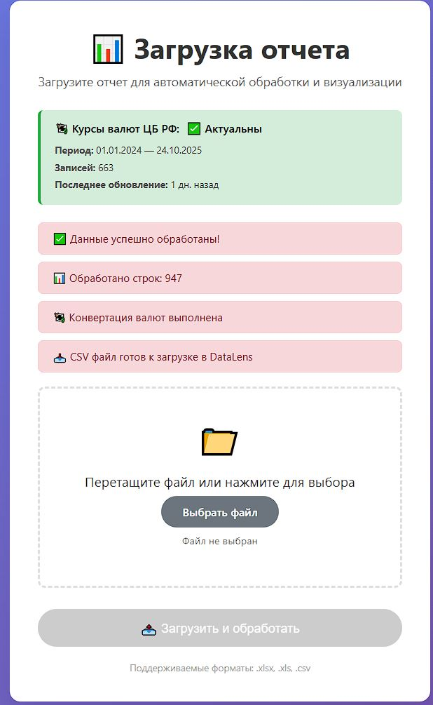
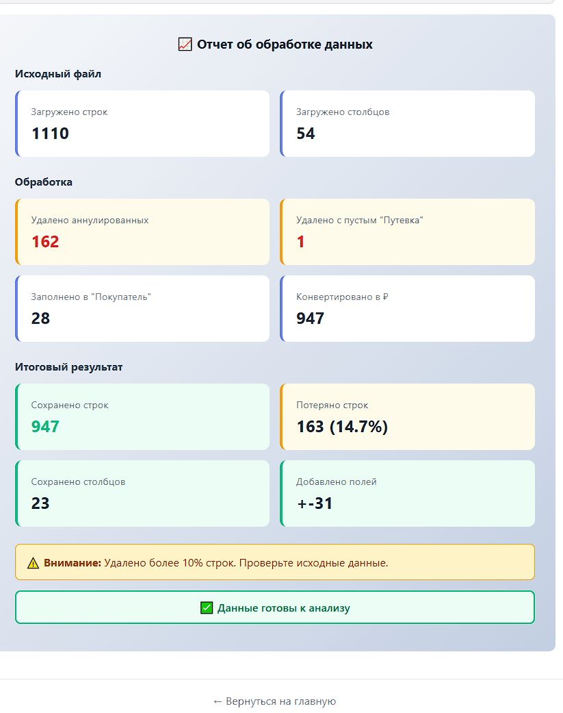
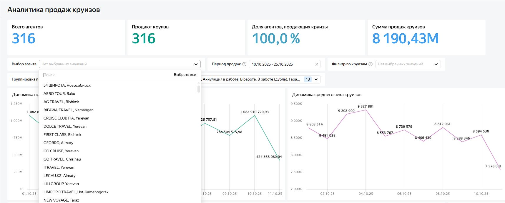
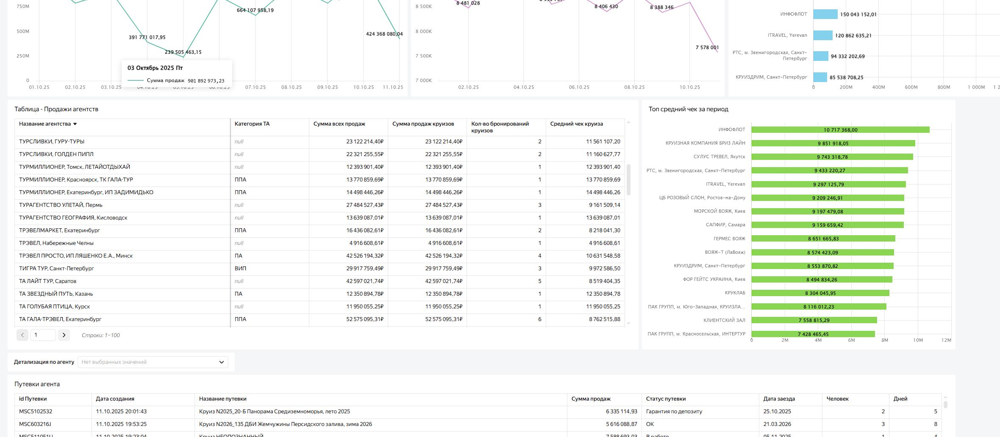

# 🌊🚢cruise-dashboard-app

## 🌐 **Web - версия:** [vulcan4ik.pythonanywhere.com](https://vulcan4ik.pythonanywhere.com/)
## 📊 **Dashboard в Yandex DataLens:** ([перейти](https://datalens.ru/z699juka5120k))

⚠️ **Важно:** Демо-версия использует измененные  данные для демонстрации функционала. Все имена агентств, суммы и клиенты — заменены на сгенерированные по просьбе компании.

# 🚢 Cruise Sales Analytics Dashboard

Веб-приложение для автоматической обработки отчетов о продажах круизов. Очищает данные, конвертирует валюты по курсу ЦБ РФ и готовит аналитические метрики для дашборда в Yandex DataLens.

## 🎬 Демонстрация работы

**Главная страница загрузки файлов**



**Статистика обработки**



**Yandex DataLens Dashboard**




## 💼 Бизнес-задача

Туроператор ежедневно получает отчеты о продажах круизов от сети агентств в разных валютах (USD, EUR, RUB). Руководителю отдела обучения необходимо отслеживать KPI продаж круизов и сравнивать их с общими показателями агентства.
Ручная обработка данных занимает **2-4 часа еженедельно**:
- Конвертация валют по курсу ЦБ РФ вручную
- Очистка дубликатов и некорректных записей
- Расчет аналитических метрик
- Подготовка данных для дашборда

При этом в компании нет специалиста, который мог бы быстро и регулярно выполнять эту задачу.

**Решение:**  
Создано приложение, которое полностью автоматизирует обработку отчётов о продажах круизов и предоставляет руководителю отдела обучения прозрачные KPI в режиме реального времени.
Система исключает ручную конвертацию валют и обработку Excel-файлов, стандартизирует данные, ускоряет подготовку отчётов и позволяет оперативно выявлять агентства, которым требуется обучение.

**📈 Результат:**  
- ⏱ Сокращение времени обработки с **2-4 часов → 30 секунд**
-  100% точность конвертации по актуальному курсу ЦБ РФ
-  Мгновенное обновление KPI в дашборде без участия сотрудника
-  Экономия **~10 часов рабочего времени руководителя в месяц**

**Детализированная статистика**



## ✅ Что было сделано 

 Ключевые задачи и решения, которые я реализовал в проекте.

### 1. Анализ бизнес-процесса и проектирование решения
- Изучил рабочий процесс туроператора и исходные выгрузки данных.  
- Определил требования к автоматизации: очистка данных, конвертация валют, расчёт метрик, подготовка данных для руководителя.  
- Спроектировал архитектуру сервиса: веб-приложение, модуль обработки данных, интеграция с DataLens.

### 2. Разработка backend-логики обработки отчётов
Реализовал полный цикл подготовки данных: 
- удаление дубликатов;  
- фильтрация аннулированных путёвок;  
- заполнение критичных пропусков по бизнес-логике;  
- извлечение региона из названия агентства (регулярные выражения + словарь городов);  
- расчёт метрик:
  - дни до заезда;  
  - процент оплаты;  
  - сумма продажи после валютной конвертации;
  - средний чек  
- логирование всего процесса со статистикой: сколько строк удалено, изменено, восстановлено или пропущено.

### 3. Автоматизация валютных расчётов
- Разработал модуль получения курсов ЦБ РФ (XML API).  
- Реализовал конвертацию USD/EUR → RUB с учётом комиссии 4.5%.  
- Выбор курса на дату создания путёвки.  
- Оптимизация обновления курсов через локальный кэш для ускорения первого запуска.

### 4. Создание веб-приложения
- Drag-and-drop интерфейс загрузки файлов.  
- Валидация форматов (.xlsx, .xls, .csv).  
- Страница со статусом валютных курсов.  
- Вывод статистики обработки и генерация готового файла для скачивания.  


### 5. Подготовка набора данных для BI-системы
- Подготовил нормализованный датасет для DataLens.  
- Пирвел данные к единым форматам дат, сумм, валют.  

### 6. Построение дашборда в Yandex DataLens
- Подключение к DataLens через публичный dataset.  
- Создание:
  - сводки KPI продаж;  
  - аналитики по агентствам;  
  - региональной разбивки;  
  - динамики продаж.  
- Настройка фильтров, визуализации и итоговой панели для руководителя.

### 7. Деплой и запуск сервиса
- Развёртывание на PythonAnywhere.  
- Настройка структуры файлов, обновления курсов, хранения результатов.  
- Оптимизация скорости обработки: 1000 строк → ~2 секунды.  
- Подготовка документации и примеров тестовых данных.

### 📊 Метрики, которые считает приложение
- Общая сумма продаж и % оплаты.  
- Сумма после конвертации валют с комиссией 4.5%.  
- Дни до заезда, динамика продаж по агентствам и регионам.  
- Количество удалённых дубликатов и аннулированных записей.  
- Средний чек по продажам.

---

## 📊 Ключевые метрики

- **Скорость обработки:** ~1000 записей за 2-3 секунды
- **Точность конвертации:** 100% (курс ЦБ РФ + 4.5% комиссия)
- **Объем данных:** 500-1500 строк/файл (поддержка до 10,000+)
- **Экономия времени:** 2-4 часа → 30 секунд (480x ускорение)

---

## 🛠️ Технологии

- **Backend**: Python 3.12, Flask
- **Data Processing**: Pandas, NumPy
- **API Integration**: requests, xml.etree (ЦБ РФ курсы)
- **Frontend**: HTML5, CSS3, JavaScript 
- **Deployment**: PythonAnywhere.com
- **Dashboard**: [Yandex DataLens](ссылка_на_дашборд)

## Установка и запуск

### Требования
- Python 3.8+
- pip

### web - версия:
- https://vulcan4ik.pythonanywhere.com/

### Локальная установка
#### 📂 Структура проекта

```
dashboard-cruise-app/
│
├── 📄 README.md                       # Описание проекта
├── 📄 requirements.txt                # Зависимости Python
├── 📄 .gitignore                      # Исключения для Git
│
├── 🐍 app.py                          # Главный файл Flask приложения
├── 🐍 processsing.py                  # Обработка и очистка данных
├── 🐍 currency_updater.py             # Обновление курсов валют 
│
├── 📁 templates/                      # HTML шаблоны
│   ├── index.html                     # Главная страница с загрузкой файлов
│   └── success.html                   # Страница успешной обработки
│
├── 📁 sample_data/                    # Примеры данных (обезличенные)
│   ├── sample_input.xlsx              # Пример входного файла
│   └── sample_output.csv              # Пример обработанного файла
│
├── 📁 app_data/
│   └── currency_rates_2024-2025.csv   # Курсы валют ЦБ РФ (2024-2025)
│
├── 📁 uploads/                        # Временное хранение загруженных файлов
├── 📁 results/                        # Обработанные файлы для скачивания
│
└── 📁 docs/
    └── DEPLOYMENT.md                   # Инструкция по развертыванию
    └── images/ # Скриншоты для README  # Скриншоты для README               
```

1. Клонируйте репозиторий:
```
git clone https://github.com/vulcan4ik/cruise-dashboard-app.git
cd dashboard-cruise-app
```
2. Создайте виртуальное окружение:
```
python -m venv venv
source venv/bin/activate # Linux/Mac
venv\Scripts\activate # Windows
```
3. Установите зависимости:
`pip install -r requirements.txt`

4. Создайте необходимые папки:
mkdir -p uploads results app_data

5. поместите файл `currency_rates_2024-2025.csv` в директорию `/home/<username>/dashboard-cruise-app/app_data/` чтобы уменьшить время на обновление курса валют при первом запуске

6. Запустите приложение:
python app.py

7. Откройте в браузере: `http://127.0.0.1:5000`


## Деплой на PythonAnywhere

Подробная инструкция в [docs/DEPLOYMENT.md](docs/DEPLOYMENT.md)


## Планы развития

- [ ] Автоматическая загрузка в DataLens 
- [ ] История загрузок файлов
- [ ] Поддержка дополнительных валют

## Автор

Alexey Kharchenko, Data Analyst
- GitHub: [@vulcan4ik](https://github.com/vulcan4ik)
- tg: https://t.me/vulcan4ik
- Email: vulcanxxx@yandex.ru  

